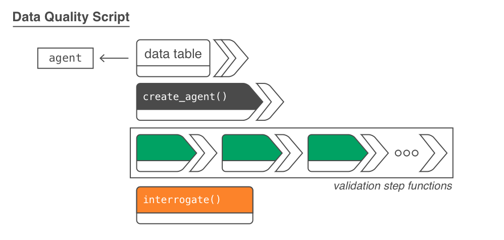

<!-- README.md is generated from README.Rmd. Please edit that file -->

```{r setup, include = FALSE}
knitr::opts_chunk$set(
  collapse = TRUE,
  comment = "#>",
  fig.path = "man/figures/README-",
  out.width = "100%"
)

library(pointblank)
library(dplyr)
```

# pointblank <a href='http://rich-iannone.github.io/pointblank/'></a>

[](https://cran.r-project.org/package=pointblank)
[](https://github.com/rich-iannone/pointblank/actions)
[](https://codecov.io/gh/rich-iannone/pointblank?branch=master)

With the **pointblank** package it's really easy to validate your data with workflows attuned to your data quality needs. The **pointblank** philosophy: a set of validation functions should work seamlessly with data in local data tables and with data in databases.

The two dominant workflows that **pointblank** enables are *data quality reporting* and *pipeline-based data validations*. Both workflows make use of a large collection of simple validation functions (e.g., are values in a specific column greater than those in another column or some fixed value?), and, both allow for stepwise, temporary mutation/alteration of the input table (through `preconditions`) to enable much more sophisticated validation checks.

<hr>



The first workflow, *data quality reporting* allows for the easy creation of a data quality analysis report. This is most useful in a non-interactive mode where data quality for database tables and on-disk data files must be periodically checked. The reporting component (through a **pointblank** agent) allows for the collection of detailed validation measures for each validation step, the optional extraction of data rows that failed validation (with options on limits), and custom functions that are invoked by exceeding set threshold failure rates. Want to email the report regularly (or, only if certain conditions are met)? Yep, you can do all that.

<hr>


The second workflow, *pipeline-based data validations* gives us a different validation scheme that is valuable for data validation checks during an ETL process. With **pointblank**'s validation functions, we can directly operate on data and trigger warnings, raise errors, or write out logs when exceeding specified failure thresholds. It's a cinch to perform checks on import of the data and at key points during the transformation process, perhaps stopping everything if things are exceptionally bad with regard to data quality.

<hr>

The **pointblank** package is designed to be both straightforward yet powerful. And fast! Local data frames don't take very long to validate extensively and all validation checks on remote tables are done entirely in-database. So we can add dozens or even hundreds of validation steps without any long waits for reporting. Here is an example of how to use **pointblank** to validate a local table with an agent.

```{r simple_tibble_example, eval = FALSE}
# Generate a simple `action_levels` object to
# set the `warn` state if a validation step
# has a single 'fail' test unit
al <- action_levels(warn_at = 1)

# Create a pointblank `agent` object, with the
# tibble as the target table. Use three validation
# functions, then, `interrogate()`. The agent will
# then have some useful intel.
agent <- 
  dplyr::tibble(
    a = c(5, 7, 6, 5, NA, 7),
    b = c(6, 1, 0, 6,  0, 7)
  ) %>%
  create_agent(
    label = "A very *simple* example.",
    actions = al
  ) %>%
  col_vals_between(vars(a), 1, 9, na_pass = TRUE) %>%
  col_vals_lt(vars(c), 12, preconditions = ~ . %>% dplyr::mutate(c = a + b)) %>%
  col_is_numeric(vars(a, b)) %>%
  interrogate()
```

```{r output, echo=FALSE}
al <- action_levels(warn_at = 1)

agent <- 
  dplyr::tibble(
    a = c(5, 7, 6, 5, NA, 7),
    b = c(6, 1, 0, 6,  0, 7)
  ) %>%
  create_agent(
    label = "A very *simple* example.",
    actions = al
  ) %>%
  col_vals_between(vars(a), 1, 9, na_pass = TRUE) %>%
  col_vals_lt(vars(c), 12, preconditions = ~ . %>% dplyr::mutate(c = a + b)) %>%
  col_is_numeric(vars(a, b)) %>%
  interrogate()
```

Should you want to perform validation checks on database or *Spark* tables, provide a `tbl_dbi` or `tbl_spark` object to `create_agent()`. The **pointblank** package currently supports *PostgreSQL*. *MySQL*, *MariaDB*, *SQLite*, and *Spark DataFrames* (through the **sparklyr** package).

The reporting's pretty sweet. We can get a **gt**-based report by printing an *agent*.


<hr>

Next up is an example that follows the second, *agent*-less workflow. It's the same three validation functions as before but, this time, we use them directly on the data! In this workflow, by default, an error will occur if there is a single 'fail' test unit in any validation step:

```{r example_workflow_two_error, eval=FALSE}
dplyr::tibble(
    a = c(5, 7, 6, 5, NA, 7),
    b = c(6, 1, 0, 6,  0, 7)
  ) %>%
  col_vals_between(vars(a), 1, 9, na_pass = TRUE) %>%
  col_vals_lt(vars(c), 12, preconditions = ~ . %>% dplyr::mutate(c = a + b)) %>%
  col_is_numeric(vars(a, b))
```

```
Error: Exceedance of failed test units where values in `c` should have been < `12`.
The `col_vals_lt()` validation failed beyond the absolute threshold level (1).
* failure level (2) >= failure threshold (1) 
```

We can downgrade this to a warning with the `warn_on_fail()` helper function (assigning to `actions`). In this way, the data will be returned, but warnings will appear.

```{r example_workflow_two_warning, eval=FALSE}
# This `warn_on_fail()` function is a nice
# shortcut for `action_levels(warn_at = 1)`;
# it works great in this data checking workflow
# (and the threshold can still be adjusted)
al <- warn_on_fail()

dplyr::tibble(
    a = c(5, 7, 6, 5, NA, 7),
    b = c(6, 1, 0, 6,  0, 7)
  ) %>%
  col_vals_between(vars(a), 1, 9, na_pass = TRUE, actions = al) %>%
  col_vals_lt(vars(c), 12, preconditions = ~ . %>% dplyr::mutate(c = a + b), actions = al) %>%
  col_is_numeric(vars(a, b))
```


```{r tibble_print, echo=FALSE, paged.print=FALSE}
dplyr::tibble(
    a = c(5, 7, 6, 5, NA, 7),
    b = c(6, 1, 0, 6,  0, 7)
  )
```
```
Warning message:
Exceedance of failed test units where values in `c` should have been < `12`.
The `col_vals_lt()` validation failed beyond the absolute threshold level (1).
* failure level (2) >= failure threshold (1) 
```

Should you need more fine-grained thresholds and resultant actions, the `action_levels()` function can be used to specify multiple failure thresholds and side effects for each failure state. However, the `warn_on_fail()` and `stop_on_fail()` (applied by default, with `stop_at = 1`) helpers should in most cases suffice for this workflow.

<hr>

Using **pointblank** in an R Markdown workflow is enabled by default once the **pointblank** library is loaded. The framework allows for validation testing within specialized validation code chunks where the `validate = TRUE` option is set. Using **pointblank** validation functions on data in these marked code chunks will flag overall failure if the stop threshold is exceeded anywhere. All errors are reported in the validation code chunk after rendering the document to HTML, where green or red status buttons indicate whether all validations succeeded or failures occurred. Click them to reveal the otherwise hidden validation statements and any associated error messages.

<p align="center"></p>

The above R Markdown document is available as a template in the RStudio IDE (it's called `Pointblank Validation`). Try it out!

<hr>

While data validation is important, one has to be familiar with the data first. To that end, the `scan_data()` function is provided in **pointblank** for generating a comprehensive summary of a tabular dataset. The report content is customizable, can be used inside an R Markdown document, and (as with the validation report) it can be produced in five different languages: *English*, *French*, *German*, *Italian*, and *Spanish*. Here are several published examples of a **Table Scan** for each of these languages using the `dplyr::storms` dataset. Clicking any of these will take you to a highly interactive **RPubs** document.

[](https://rpubs.com/rich_i/pointblank_storms_english)&nbsp;&nbsp;&nbsp;
[](https://rpubs.com/rich_i/pointblank_storms_french)&nbsp;&nbsp;&nbsp;
[](https://rpubs.com/rich_i/pointblank_storms_german)&nbsp;&nbsp;&nbsp;
[](https://rpubs.com/rich_i/pointblank_storms_italian)&nbsp;&nbsp;&nbsp;
[](https://rpubs.com/rich_i/pointblank_storms_spanish)

Database tables can be used with `scan_data()` as well. Here are two examples using the `full_region` table of the **Rfam** database (hosted publicly at "mysql-rfam-public.ebi.ac.uk") and the `assembly` table of the **Ensembl** database (hosted publicly at "ensembldb.ensembl.org").

[](https://rpubs.com/rich_i/rfam_full_region)&nbsp;&nbsp;&nbsp;
[](https://rpubs.com/rich_i/ensembl_assembly)

<hr>

There are many functions available in **pointblank** for making comprehensive table validations. Each validation function is associated with an expectation function (of the form `expect_*()`). They are equivalent in usage and behavior to **testthat** tests with the big distinction that they check aspects of data tables (and not the results of function calls). Furthermore, each validation function has an associated test function (of the form `test_*()`) which always returns a logical value (`TRUE` or `FALSE`).

<p align="center"></p>

Want to try this out? The **pointblank** package is available on **CRAN**:

```{r install_cran, eval=FALSE}
install.packages("pointblank")
```

You can also install the development version of **pointblank** from **GitHub**:

```{r install_github, eval=FALSE}
devtools::install_github("rich-iannone/pointblank")
```

If you encounter a bug, have usage questions, or want to share ideas to make this package better, feel free to file an [issue](https://github.com/rich-iannone/pointblank/issues).

<hr>

#### How **pointblank** Fits in with Other Packages that Validate Tabular Data

The **pointblank** package isn't the only one of its kind available for **R**. The reason for introducing yet another has to do with **pointblank**'s goals:

- ability to work with local tables, database tables, and Spark DataFrames (via **sparklyr**) with minimal changes in the API
- great flexibility in data validation workflows, allowing for: (1) report-based validations, (2) inline validations, (3) validation of data tables in unit tests (with the set of `expect_*()` functions), and (4) validation of data tables to support conditional expressions (with the set of `test_*()` functions) 
- extra tools for understanding new datasets (`scan_data()`) and validating data in specialized R Markdown code chunks (`validate_rmd()`)
- reporting outputs translated to multiple spoken languages
- developing an API that closely follows tidyverse conventions by adhering to the [tidyverse style guide](https://style.tidyverse.org)
- lots of attention on making the package documentation and examples the best they can be

While **pointblank** is trying to do something different, it may not suit your specific needs. Here is a listing of some other validation **R** packages:

**assertr**&nbsp;([GITHUB](https://github.com/ropensci/assertr),&nbsp;[WEBSITE](https://docs.ropensci.org/assertr))

**validate**&nbsp;([GITHUB](https://github.com/data-cleaning/validate))

**dataMaid**&nbsp;([GITHUB](https://github.com/ekstroem/dataMaid))

<hr>

##### Code of Conduct

Please note that the pointblank project is released with a [Contributor Code of Conduct](https://www.contributor-covenant.org/version/1/0/0/code-of-conduct/).<br>By participating in this project you agree to abide by its terms.

#### License

MIT &copy; Richard Iannone
