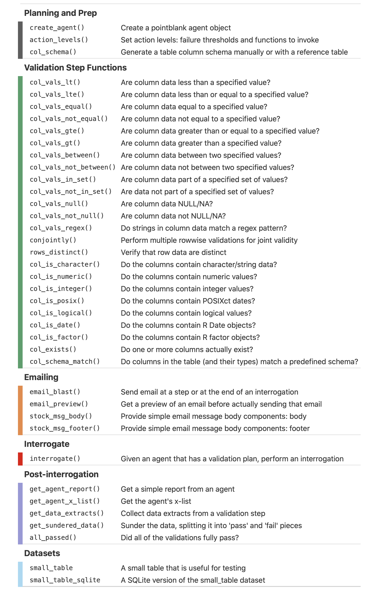

<!-- README.md is generated from README.Rmd. Please edit that file -->

```{r setup, include = FALSE}
knitr::opts_chunk$set(
  collapse = TRUE,
  comment = "#>",
  fig.path = "man/figures/README-",
  out.width = "100%"
)

library(pointblank)
library(dplyr)
```

# pointblank <a href='http://rich-iannone.github.io/pointblank/'></a>

[](https://cran.r-project.org/package=pointblank)
[](https://travis-ci.org/rich-iannone/pointblank)
[](https://codecov.io/gh/rich-iannone/pointblank?branch=master)

With the **pointblank** package it's really easy to validate your data with workflows attuned to your data quality needs. The **pointblank** philosophy: a set of validation step functions should work seamlessly with data in local data tables and with data in databases.

The two dominant workflows that **pointblank** enables are *data quality reporting* and *pipeline-based data validations*. Both workflows make use of a large collection of simple validation step functions (e.g., are values in a specific column greater than those in another column or some fixed value?), and, both allow for stepwise, temporary mutation/alteration of the input table to enable more sophisticated validation checks.

<hr>


The first workflow, *data quality reporting* allows for the easy creation of a data quality analysis report. This is most useful in a non-interactive mode where data quality for database tables and on-disk data files must be periodically checked. The reporting component (through a **pointblank** agent) allows for the collection of detailed validation measures for each validation step, the optional extraction of data rows that failed validation (with options on limits), and custom functions that are invoked by exceeding set threshold failure rates. Want to email the report regularly (or, only if certain conditions are met)? Yep, you can do all that.

<hr>


The second workflow, *pipeline-based data validations* gives us a different validation scheme that is valuable for data validation checks during an ETL process. With **pointblank**'s validation step functions, we can directly operate on data and trigger warnings, raise errors, or write out logs when exceeding specified failure thresholds. It's a cinch to perform checks on import of the data and at key points during the transformation process, perhaps stopping everything if things are exceptionally bad with regard to data quality.

<hr>

The **pointblank** package is designed to be both straightforward yet powerful. And fast! All validation checks on remote tables are done entirely in-database so we can add dozens or hundreds of validation steps without any long waits for reporting. Here is a brief example of how to use **pointblank** to validate a local table with an agent.

```{r simple_tibble_example, eval = FALSE}
# Generate a simple `action_levels` object to
# set the `warn` state if a validation step
# has a single 'fail' unit
al <- action_levels(warn_at = 1)

# Create a pointblank `agent` object, with the
# tibble as the target table. Use two validation
# step functions, then, `interrogate()`. The
# agent now has some useful intel.
agent <- 
  dplyr::tibble(
    a = c(5, 7, 6, 5, NA, 7),
    b = c(6, 1, 0, 6,  0, 7)
  ) %>%
  create_agent(name = "simple_tibble", actions = al) %>%
  col_vals_between(vars(a), 1, 9, na_pass = TRUE) %>%
  col_vals_lt(vars(c), 12, preconditions = ~tbl %>% dplyr::mutate(c = a + b)) %>%
  interrogate()
```

```{r output, echo=FALSE}
agent <- 
  dplyr::tibble(
    a = c(5, 7, 6, 5, NA, 7),
    b = c(6, 1, 0, 6,  0, 7)
  ) %>%
  create_agent(name = "simple_tibble", actions = action_levels(warn_at = 1)) %>%
  col_vals_between(vars(a), 1, 9, na_pass = TRUE) %>%
  col_vals_lt(vars(c), 12, preconditions = ~tbl %>% dplyr::mutate(c = a + b)) %>%
  interrogate()
```

Because an *agent* was used, we can get a report from it. 

```{r get_agent_report, eval=FALSE}
agent
```


Here's another example that follows the second, *agent*-less workflow (where validation step functions operate directly on data).

```{r example_workflow_two, eval=FALSE}
# Use the same two validation step functions as before
# but, this time, use them directly on the data! By
# default, warnings are given with 1 'fail' unit
# (can be customized using the `action_levels()` function)
dplyr::tibble(
    a = c(5, 7, 6, 5, NA, 7),
    b = c(6, 1, 0, 6,  0, 7)
  ) %>%
  col_vals_between(vars(a), 1, 9, na_pass = TRUE) %>%
  col_vals_lt(vars(c), 12, preconditions = ~tbl %>% dplyr::mutate(c = a + b))
```

```
Warning message:
The validation (`col_vals_lt()`) meets or exceeds the warn threshold
 * VIOLATION: Expect that when the precondition `tbl %>% dplyr::mutate(c = a + b)`
is applied, values in `c` (computed column) should be < 12
```
```{r tibble_print, echo=FALSE, paged.print=FALSE}
dplyr::tibble(
    a = c(5, 7, 6, 5, NA, 7),
    b = c(6, 1, 0, 6,  0, 7)
  )
```

Beyond these simple examples, there are many functions available in **pointblank** for making comprehensive table validations.

<p align="center"></p>

Want to try this out? The **pointblank** package is available on **CRAN**:

```{r install_cran, eval=FALSE}
install.packages("pointblank")
```

You can also install the development version of **pointblank** from **GitHub**:

```{r install_github, eval=FALSE}
remotes::install_github("rich-iannone/pointblank")
```

If you encounter a bug, have usage questions, or want to share ideas to make this package better, feel free to file an [issue](https://github.com/rich-iannone/pointblank/issues).

## Code of Conduct

[Contributor Code of Conduct](https://github.com/rich-iannone/pointblank/blob/master/CONDUCT.md).<br>By participating in this project you agree to abide by its terms.

## License

MIT &copy; Richard Iannone
