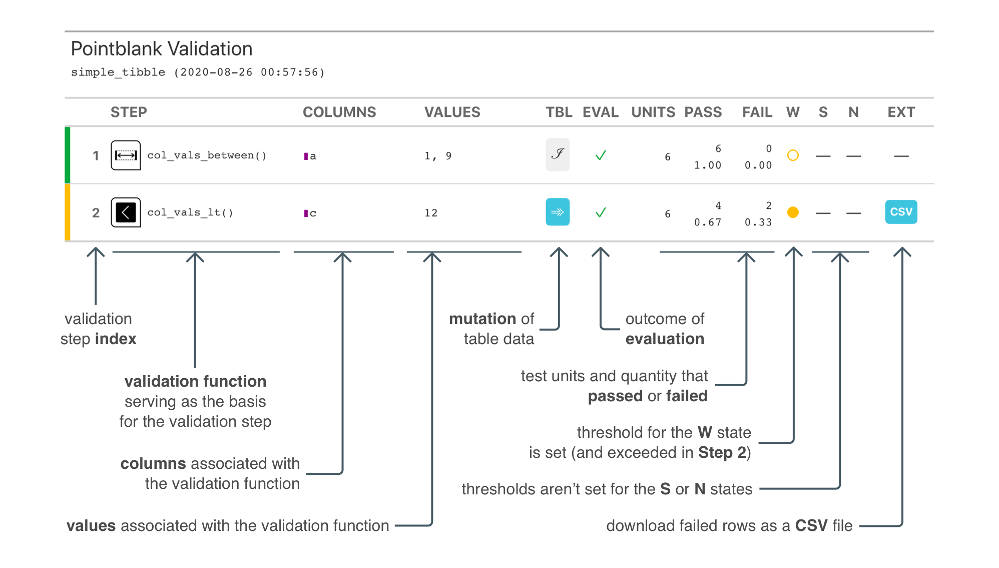
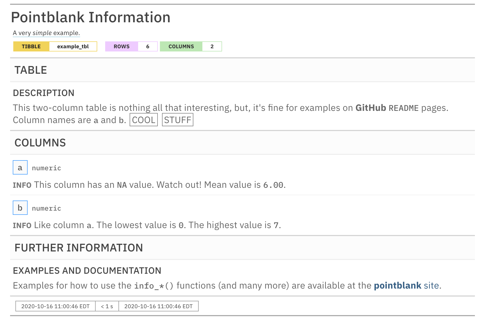

<div align="center">
<br />

<a href='https://rich-iannone.github.io/pointblank/'></a>

<!-- badges: start -->
<a href="https://cran.r-project.org/package=pointblank"></a>
<a href="https://opensource.org/license/mit/"></a>
<a href="https://github.com/rich-iannone/pointblank/actions"></a>
<a href="https://github.com/rich-iannone/pointblank/actions"></a>
<a href="https://app.codecov.io/gh/rich-iannone/pointblank?branch=main"></a>

<a href="https://bestpractices.coreinfrastructure.org/projects/4310"></a>
<a href="https://www.repostatus.org/#active"></a>
<a href="https://CRAN.R-project.org/package=pointblank"></a>
<a href="https://CRAN.R-project.org/package=pointblank"></a>

[](https://rstudio.cloud/project/3411822)

<a href="https://www.contributor-covenant.org/version/2/1/code_of_conduct.html"></a>
<!-- badges: end -->
<hr style="color:transparent" />
<br />
</div>

With the **pointblank** package it’s really easy to methodically validate your
data whether in the form of data frames or as database tables. On top of the
validation toolset, the package gives you the means to provide and keep
up-to-date with the information that *defines* your tables.

For table *validation*, the *agent* object works with a large collection of
simple (yet powerful!) validation functions. We can enable much more
sophisticated validation checks by using custom expressions, segmenting the
data, and by selective mutations of the target table. The suite of validation
functions ensures that *everything just works* no matter whether your table is
a data frame or a database table.

Sometimes, we want to maintain table *information* and update it when the table
goes through changes. For that, we can use an *informant* object plus associated
functions to help define the metadata entries and present it as a data dictionary.
Just like we can with validation, **pointblank** offers easy ways to have the
metadata updated so that this important documentation doesn't become stale.

<hr>


## TABLE VALIDATIONS WITH AN AGENT AND DATA QUALITY REPORTING

Data validation can be carried out in *Data Quality Reporting* workflow, 
ultimately resulting in the production of of a data quality analysis report.
This is most useful in a non-interactive mode where data quality for database
tables and on-disk data files must be periodically checked. The **pointblank**
*agent* is given a collection of validation functions to define validation
steps. We can get extracts of data rows that failed validation, set up custom
functions that are invoked by exceeding set threshold failure rates, etc. Want
to email the report regularly (or, only if certain conditions are met)? Yep,
you can do all that.

Here is an example of how to use **pointblank** to validate a local table
with an *agent*.

``` r
# Generate a simple `action_levels` object to
# set the `warn` state if a validation step
# has a single 'fail' test unit
al <- action_levels(warn_at = 1)

# Create a pointblank `agent` object, with the
# tibble as the target table. Use three validation
# functions, then, `interrogate()`. The agent will
# then have some useful intel.
agent <- 
  dplyr::tibble(
    a = c(5, 7, 6, 5, NA, 7),
    b = c(6, 1, 0, 6,  0, 7)
  ) %>%
  create_agent(
    label = "A very *simple* example.",
    actions = al
  ) %>%
  col_vals_between(
    vars(a), 1, 9,
    na_pass = TRUE
  ) %>%
  col_vals_lt(
    vars(c), 12,
    preconditions = ~ . %>% dplyr::mutate(c = a + b)
  ) %>%
  col_is_numeric(vars(a, b)) %>%
  interrogate()
```

The reporting’s pretty sweet. We can get a **gt**-based report by
printing an *agent*.



The **pointblank** package is designed to be both straightforward yet
powerful. And fast\! Local data frames don’t take very long to validate
extensively and all validation checks on remote tables are done entirely
in-database. So we can add dozens or even hundreds of validation steps
without any long waits for reporting.

Should you want to perform validation checks on database or *Spark*
tables, provide a `tbl_dbi` or `tbl_spark` object to `create_agent()`.
The **pointblank** package currently supports *PostgreSQL*. *MySQL*,
*MariaDB*, *Microsoft SQL Server*, *Google BigQuery*, *DuckDB*, *SQLite*, and
*Spark DataFrames* (through the **sparklyr** package).

Here are some validation reports for the considerably larger 
`intendo::intendo_revenue` table.

<a href="https://rpubs.com/rich_i/intendo_rev_postgres"></a>   
<a href="https://rpubs.com/rich_i/intendo_rev_mysql"></a>   
<a href="https://rpubs.com/rich_i/intendo_rev_duckdb"></a>

<hr>


## VALIDATIONS DIRECTLY ON DATA

The *Pipeline Data Validation* workflow uses the same collection of validation
functions but without need of an *agent*. This is useful for an ETL process
where we want to periodically check data and trigger warnings, raise errors, or
write out logs when exceeding specified failure thresholds. It’s a cinch to
perform checks on import of the data and at key points during the transformation
process, perhaps stopping data flow if things are unacceptable with regard to
data quality.

The following example uses the same three validation functions as before but,
this time, we use them directly on the data. The validation functions act as a
filter, passing data through unless execution is stopped by failing validations
beyond the set threshold. In this workflow, by default, an error will occur if
there is a single ‘fail’ test unit in any validation step:

``` r
dplyr::tibble(
    a = c(5, 7, 6, 5, NA, 7),
    b = c(6, 1, 0, 6,  0, 7)
  ) %>%
  col_vals_between(
    vars(a), 1, 9,
    na_pass = TRUE
  ) %>%
  col_vals_lt(
    vars(c), 12,
    preconditions = ~ . %>% dplyr::mutate(c = a + b)
  ) %>%
  col_is_numeric(vars(a, b))
```

    Error: Exceedance of failed test units where values in `c` should have been < `12`.
    The `col_vals_lt()` validation failed beyond the absolute threshold level (1).
    * failure level (2) >= failure threshold (1) 

We can downgrade this error to a warning with the `warn_on_fail()` helper
function (assigning it to `actions`). In this way, the data will always be
returned, but warnings will appear.

``` r
# The `warn_on_fail()` function is a nice
# shortcut for `action_levels(warn_at = 1)`;
# it works great in this data checking workflow
# (and the threshold can still be adjusted)
dplyr::tibble(
    a = c(5, 7, 6, 5, NA, 7),
    b = c(6, 1, 0, 6,  0, 7)
  ) %>%
  col_vals_between(
    vars(a), 1, 9,
    na_pass = TRUE,
    actions = warn_on_fail()
  ) %>%
  col_vals_lt(
    vars(c), 12,
    preconditions = ~ . %>% dplyr::mutate(c = a + b),
    actions = warn_on_fail()
  ) %>%
  col_is_numeric(
    vars(a, b),
    actions = warn_on_fail()
  )
```

    #> # A tibble: 6 x 2
    #>       a     b
    #>   <dbl> <dbl>
    #> 1     5     6
    #> 2     7     1
    #> 3     6     0
    #> 4     5     6
    #> 5    NA     0
    #> 6     7     7

    Warning message:
    Exceedance of failed test units where values in `c` should have been < `12`.
    The `col_vals_lt()` validation failed beyond the absolute threshold level (1).
    * failure level (2) >= failure threshold (1) 

Should you need more fine-grained thresholds and resultant actions, the
`action_levels()` function can be used to specify multiple failure
thresholds and side effects for each failure state. However, with
`warn_on_fail()` and `stop_on_fail()` (applied by default, with
`stop_at = 1`), you should have good enough options for this validation
workflow.

<hr>

## VALIDATIONS IN R MARKDOWN DOCUMENTS

Using **pointblank** in an R Markdown workflow is enabled by default
once the **pointblank** library is loaded. The framework allows for
validation testing within specialized validation code chunks where the
`validate = TRUE` option is set. Using **pointblank** validation
functions on data in these marked code chunks will flag overall failure
if the stop threshold is exceeded anywhere. All errors are reported in
the validation code chunk after rendering the document to HTML, where
green or red status buttons indicate whether all validations succeeded
or failures occurred. Click them to reveal the otherwise hidden
validation statements and any associated error messages.

<p align="center">


</p>

The above R Markdown document is available as a template in the RStudio
IDE (it’s called `Pointblank Validation`). Try it out\!

<hr>

## TABLE INFORMATION

Table information can be synthesized in an *information management* workflow,
giving us a snapshot of a data table we care to collect information on.
The **pointblank** *informant* is fed a series of `info_*()` functions to
define bits of information about a table. This info text can pertain to
individual columns, the table as a whole, and whatever additional information
makes sense for your organization. We can even glean little snippets of
information (like column stats or sample values) from the target table with
`info_snippet()` and the `snip_*()` functions and mix them into the data
dictionary wherever they're needed.

Here is an example of how to use **pointblank** to incorporate pieces of
info text into an *informant* object.

``` r
# Create a pointblank `informant` object, with the
# tibble as the target table. Use a few information
# functions and end with `incorporate()`. The informant
# will then show you information about the tibble.
informant <- 
  dplyr::tibble(
    a = c(5, 7, 6, 5, NA, 7),
    b = c(6, 1, 0, 6,  0, 7)
  ) %>%
  create_informant(
    label = "A very *simple* example.",
    tbl_name = "example_tbl"
  ) %>%
  info_tabular(
    description = "This two-column table is nothing all that
    interesting, but, it's fine for examples on **GitHub**
    `README` pages. Column names are `a` and `b`. ((Cool stuff))"
  ) %>%
  info_columns(
    columns = "a",
    info = "This column has an `NA` value. [[Watch out!]]<<color: red;>>"
  ) %>%
  info_columns(
    columns = "a",
    info = "Mean value is `{a_mean}`."
  ) %>%
  info_columns(
    columns = "b",
    info = "Like column `a`. The lowest value is `{b_lowest}`."
  ) %>%
  info_columns(
    columns = "b",
    info = "The highest value is `{b_highest}`."
  ) %>%
  info_snippet(
    snippet_name = "a_mean",
    fn = ~ . %>% .$a %>% mean(na.rm = TRUE) %>% round(2)
  ) %>%
  info_snippet(snippet_name = "b_lowest", fn = snip_lowest("b")) %>%
  info_snippet(snippet_name = "b_highest", fn = snip_highest("b")) %>%
  info_section(
    section_name = "further information", 
    `examples and documentation` = "Examples for how to use the
    `info_*()` functions (and many more) are available at the
    [**pointblank** site](https://rich-iannone.github.io/pointblank/)."
  ) %>%
  incorporate()
```

By printing the *informant* we get the table information report.



Here is a link to a hosted information report for the `intendo::intendo_revenue` table:

[](https://rpubs.com/rich_i/info_revenue_postgres)

<hr>

## TABLE SCANS

We can use the `scan_data()` function to generate a comprehensive summary of a tabular dataset. This allows us to quickly understand what's in the dataset and it helps us determine if there are any peculiarities within the data. Scanning the `dplyr::storms` dataset with `scan_data(tbl = dplyr::storms)` gives us an interactive HTML report. Here are a few of them, published in **RPubs**:

[](https://rpubs.com/rich_i/scan_data_storms)

[](https://rpubs.com/rich_i/scan_data_game_revenue)


Database tables can be used with `scan_data()` as well. Here are two examples using (1) the `full_region` table of the **Rfam** database (hosted publicly at `mysql-rfam-public.ebi.ac.uk`) and (2) the `assembly` table of the **Ensembl** database (hosted publicly at `ensembldb.ensembl.org`).

[](https://rpubs.com/rich_i/rfam_full_region)

[](https://rpubs.com/rich_i/ensembl_assembly)

<hr>

## OVERVIEW OF PACKAGE FUNCTIONS

There are many functions available in **pointblank** for understanding data
quality and doing data documentation. Here is an overview of all of them,
grouped by family. For much more information on these, visit the
[documentation website](https://rich-iannone.github.io/pointblank/) or take
a *Test Drive* in the [Posit Cloud project](https://rstudio.cloud/project/3411822).

<p align="center">


</p>

<hr>

## DISCUSSIONS

Let's talk about data validation and data documentation in
[**pointblank** Discussions](https://github.com/rich-iannone/pointblank/discussions)! It's a great place to ask questions about how to use the package, discuss
some ideas, engage with others, and much more!

## INSTALLATION

Want to try this out? The **pointblank** package is available on **CRAN**:

``` r
install.packages("pointblank")
```

You can also install the development version of **pointblank** from **GitHub**:

``` r
devtools::install_github("rich-iannone/pointblank")
```

If you encounter a bug, have usage questions, or want to share ideas to
make this package better, feel free to file an
[issue](https://github.com/rich-iannone/pointblank/issues).

<hr>

## How **pointblank** Fits in with Other Packages that Validate Tabular Data

The **pointblank** package isn’t the only one of its kind available for
**R**. The reason for introducing yet another has to do with
**pointblank**’s goals:

  - making it possible to work with local tables, database tables, and Spark
    DataFrames (via **sparklyr**) with the same API
  - providing great flexibility in data validation workflows, allowing for:
    (1) report-based validations, (2) inline validations, (3) validation of
    data tables in unit tests (with the set of `expect_*()` functions),
    and (4) validation of data tables to support conditional expressions
    (with the set of `test_*()` functions)
  - enabling a workflow for collecting and reporting on useful
    information about your data tables (i.e., making data dictionaries)
  - giving you a tool for understanding new datasets: `scan_data()`
  - having the option to translate reporting outputs to multiple
    spoken languages
  - developing an API that closely follows tidyverse conventions by
    adhering to the [tidyverse style guide](https://style.tidyverse.org)
  - ensuring that the package is very well-tested so that you can
    trust the validations (there are over 6,000 unit tests so far)
  - putting lots of attention on making the package documentation and examples
    the best they can be

While **pointblank** is trying to do something a little different, it may not
suit your specific needs. That's totally fine, here's a listing of some other
great **R** packages for data validation:

**assertr** ([GITHUB](https://github.com/ropensci/assertr/), [WEBSITE](https://docs.ropensci.org/assertr/))

**validate** ([GITHUB](https://github.com/data-cleaning/validate))

**dataReporter** ([GITHUB](https://github.com/ekstroem/dataReporter))

<hr>

## Code of Conduct

Please note that the pointblank project is released with a [contributor
code of
conduct](https://www.contributor-covenant.org/version/2/0/code_of_conduct/).<br>By
participating in this project you agree to abide by its terms.

## 📄 License

**pointblank** is licensed under the MIT license.
See the [`LICENSE.md`](LICENSE.md) file for more details.

## 🏛️ Governance

This project is primarily maintained by [Rich Iannone](https://twitter.com/riannone). Other authors may occasionally assist with some of these duties.

<hr>
