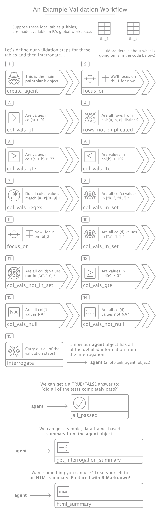
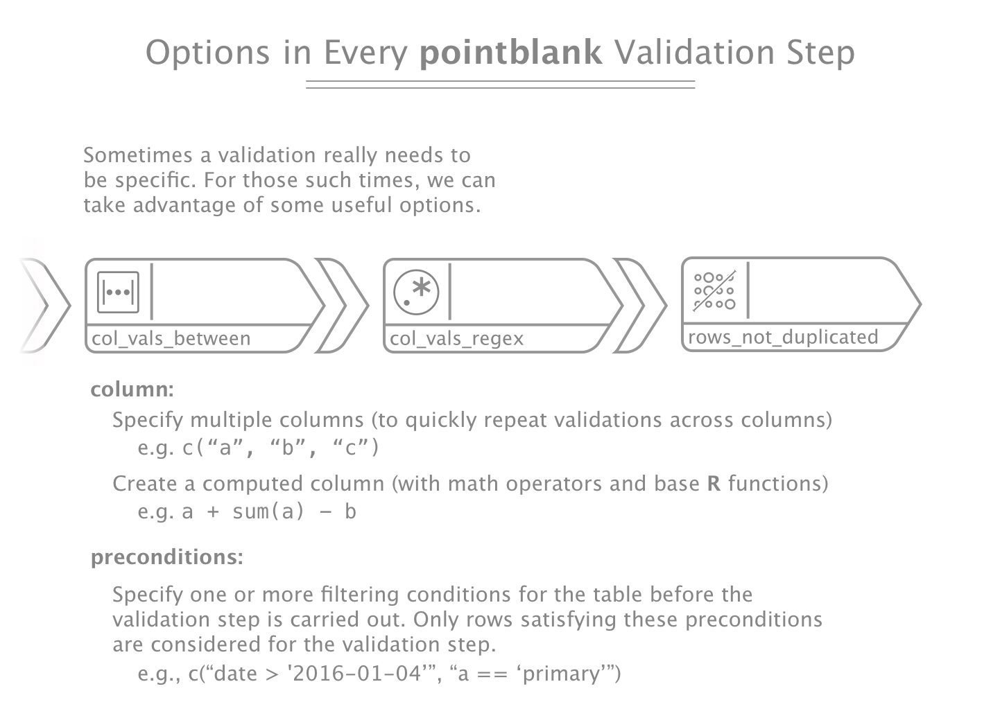

[](https://travis-ci.org/rich-iannone/pointblank)
[](https://codecov.io/github/rich-iannone/pointblank?branch=master) 

## We All Need to Validate our Data Sometimes

Tables can often be trustworthy. All the data seems to be there and we may feel we can count on these 
tables to deliver us the info we need. Still, sometimes, the tables we trust are hiding things from
us. Malformed strings, numbers we don't expect, missing values that ought not to be missing. These
abberations can be hiding almost in plain sight. Such inconsistencies can be downright insidious, and with time all of this makes us ask ourselves, "can we really trust any table?"

Sure, we can sit down with a table during a long interrogation session and rough it up with a little **SQL**. The problem is we have lots of tables, and we usually have a lot of columns in every one of these tables. Makes for long hours with many suspect tables...

We need a tool like **pointblank**. It lets us get up close with tables and unleash a fury of validation checks. Are some tables remote? That's no problem, we'll interrogate them from afar. In essence, your DB tables can get the same line of questioning as your local data frames or those innocent-looking tibbles. Trust me, they'll start to talk and then they'll surely reveal what they're hiding after a **pointblank** session.

You don't have to type up a long report either, **pointblank** will take care of the paperwork. At the very least, you can get a `yes` or `no` as to whether everything checked out. With a little bit of planning, a very informative validation report can be regularly produced.

### Validating Local Data Frames

The **pointblank** package can validate data in local data frames, local tibble objects, in CSV and TSV files, and in database tables (**PostgreSQL** and **MySQL**). First, let's look at local tables with...



The above workflow relied on these code blocks:

  (1) Create 2 very simple **R** **tibble** objects:

```r
tbl_1 <-
  tibble::tribble(
    ~a, ~b,   ~c,
    1,   6,   "h2adb",
    2,   7,   "h2spb",
    3,   8,   "h2df",
    4,   9,   "d3jwb",
    5,  10,   "h2esf")

tbl_2 <-
  tibble::tribble(
    ~d,   ~e,  ~f,
    "a",   0,  32,
    "b",   0,  31,
    "a",   1,  30,
    "a",   1,  32,
    "ae", -1,  39)
```

  (2) Create a **pointblank** pipeline for validating both the `tbl_1` and `tbl_2` tables (ending with `interrogate()`):

```r
agent <- 
  create_agent() %>%             # (1)
  focus_on(
    tbl_name = "tbl_1") %>%      # (2)
  col_vals_gt(
    column = "a",
    value = 0) %>%               # (3)
  rows_not_duplicated(
    cols = "a, b, c") %>%        # (4)
  col_vals_gte(
    column = "a + b",
    value = 7) %>%               # (5)
  col_vals_lte(
    column = "b",
    value = 10) %>%              # (6)
  col_vals_regex(
    column = "c",
    regex = "h2.*") %>%          # (7)
  col_vals_in_set(
    column = "substr(c, 0, 2)",
    set = c("h2", "d3")) %>%     # (8)
  focus_on(
    tbl_name = "tbl_2") %>%      # (9)
  col_vals_in_set(
    column = "d",
    set = c("a", "b")) %>%       # (10)
  col_vals_not_in_set(
    column = "d",
    set = c("a", "b")) %>%       # (11)
  col_vals_gte(
    column = "e",
    value = 0) %>%               # (12)
  col_vals_null(
    column = "f") %>%            # (13)
  col_vals_not_null(
    column = "d") %>%            # (14)
  interrogate()                  # (15)
```

### Function Roundup

That last workflow example provided a glimpse of some of the functions available. Just for the sake of completeness, here's the entire set of functions. A veritable smorgasbord of validation functionality, really.


### More Specificity in Your Validations

Every validation function has a common set of options for constraining validations to certain conditions. This can occur through the use of computed columns and also through preconditions that can allow you to target validations on only those rows that satify one or more conditions. 



### Validating Tables in a Database

To validate tables in a database (PostgreSQL and MySQL), we can first create a credentials file.

```r
create_creds_file(
  file = "pg_redshift_dev",
  dbname = ***********,
  host = ***********************,
  port = ***,
  user = ********,
  password = **************)
```

A database table can be treated similarly to a local data frame.

```r
agent <- 
  create_agent() %>%
  focus_on(
    tbl_name = "table_1",
    db_type = "PostgreSQL",
    creds_file = "./pg_redshift_dev",
    initial_sql = "WHERE date > '2017-01-15'") %>%
  rows_not_duplicated() %>%
  col_vals_gte(
    column = "a",
    value = 2) %>%
  col_vals_between(
    column = "b + c + d",
    left = 50,
    right = 100) %>%
  col_vals_not_null(
    column = "e",
    preconditions = "is.na(d)") %>%
  interrogate()
```

Get a summary of the interrogations and then know if something is amiss...

```r
get_summary(agent)
```

...or create a shareable, self-contained HTML report that shows how the validation went.

```r
html_summary(agent)
```

## Installation

**pointblank** is used in an **R** environment. If you don't have an **R** installation, it can be obtained from the [**Comprehensive R Archive Network (CRAN)**](https://cran.r-project.org/).

You can install the development version of **pointblank** from **GitHub** using the **devtools** package.

```r
devtools::install_github("rich-iannone/pointblank")
```
