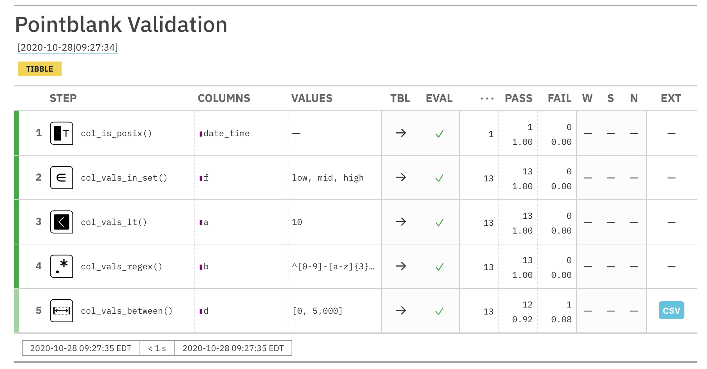

```{r options, message=FALSE, warning=FALSE, include=FALSE}
knitr::opts_chunk$set(
  collapse = TRUE,
  comment = "#>"
)

library(pointblank)
```


### Introduction to the **Data Quality Reporting** Workflow (**VALID-I**)

When trying to assess the state of data quality for tabular data, we want to perform a full accounting of assertions on the data without stopping anywhere in the interrogation of the data. We use an object called an *agent* to collect our validation instructions, perform the interrogation, and then serve as an artifact for reporting or further analysis. We give that agent the name or a function that retrieves the target table. The types of data tables that can be used include data frames, tibbles, database tables (`tbl_dbi`), and Spark DataFrames (`tbl_spark`).

#### The Elements of this Workflow: an *agent*, validation functions, and `interrogate()`

The *agent* that we need for this workflow is created with the `create_agent()` function. An agent can handle one target table at any given time and two different arguments can be used to specify that table. The first is `tbl`, where the input table is directly supplied to the *agent*. Alternatively, a function can be used to read in the input data table with the `read_fn` argument in one of two ways: (1) using a function (e.g., `function() { <table reading code> }`) or, (2) with an **R** formula expression (e.g., `~ <table reading code>`).

The *agent* needs directives on what to do with the table, so, we provide validation functions. Some check for the existence or type of column (`col_exists()` or the group of `col_is_*()` functions). Others check each cell in a column for satisfying a specific condition (the `col_vals_*()` functions). We can use as many of these as necessary for satisfactory validation testing of the table in question. There are certainly quite a few of them, so here's a list of the validation functions with a questioning phrase for each function's purpose:

- `col_vals_lt()`: Are column data less than a specified value?
- `col_vals_lte()`: Are column data less than or equal to a specified value?
- `col_vals_equal()`: Are column data equal to a specified value?
- `col_vals_not_equal()`: Are column data not equal to a specified value?
- `col_vals_gte()`: Are column data greater than or equal to a specified value?
- `col_vals_gt()`: Are column data greater than a specified value?
- `col_vals_between()`: Are column data between two specified values?
- `col_vals_not_between()`: Are column data not between two specified values?
- `col_vals_in_set()`: Are column data part of a specified set of values?
- `col_vals_not_in_set()`: Are data not part of a specified set of values?
- `col_vals_null()`: Are column data `NULL`/`NA`?
- `col_vals_not_null()`: Are column data not `NULL`/`NA`?
- `col_vals_regex()`: Do strings in column data match a regex pattern?
- `col_vals_expr()`: Do column data agree with a predicate expression?
- `conjointly()`: Do multiple rowwise validations result in joint validity?
- `rows_distinct()`: Are row data distinct?
- `col_is_character()`: Do the columns contain character/string data?
- `col_is_numeric()`: Do the columns contain numeric values?
- `col_is_integer()`: Do the columns contain integer values?
- `col_is_logical()`: Do the columns contain logical values?
- `col_is_date()`: Do the columns contain R `Date` objects?
- `col_is_posix()`: Do the columns contain `POSIXct` dates?
- `col_is_factor()`: Do the columns contain R `factor` objects?
- `col_exists()`: Do one or more columns actually exist?
- `col_schema_match()`: Do columns in the table (and their types) match a predefined schema?

The final function that needs to be called is the `interrogate()` function. The validation functions, when called on an *agent* object, don't act on the target table until `interrogate()` is used. Until interrogation, the usage of validation functions serves as instructions. During the interrogation phase those instructions turn into actions, with the *agent* then carrying out all steps of the interrogation plan.

#### A Simple Example with the Basics

For our examples going forward, we'll use the `small_table` dataset. It's included in the **pointblank** package. It isn't very large, which makes it great for simple examples. Here it is in its entirety:

```{r small_table, paged.print=FALSE}
small_table
```

What follows is a very simple validation plan. We will test that:

1. the `date_time` column is indeed a date-time column
2. column `f` only has the values `"low"`, `"mid"`, and `"high"`
3. the values in column `a` are all less than `10`
4. The strings in column `b` fit a particular regex pattern (`"^[0-9]-[a-z]{3}-[0-9]{3}$"`)
5. column `d` has values in the range of `0` to `5000` (this is not entirely true!)

This is how the validation plan is written and interrogated. When carried out interactively, you'll get status messages that describe how the interrogation is going.

```{r agent_small_table}
agent <- 
  create_agent(tbl = small_table) %>%
  col_is_posix(vars(date_time)) %>%
  col_vals_in_set(vars(f), set = c("low", "mid", "high")) %>%
  col_vals_lt(vars(a), value = 10) %>%
  col_vals_regex(vars(b), regex = "^[0-9]-[a-z]{3}-[0-9]{3}$") %>%
  col_vals_between(vars(d), left = 0, right = 5000) %>%
  interrogate()
```

```
── Interrogation Started - there are 5 steps ──────────────────────────────────
✓ Step 1: OK.
✓ Step 2: OK.
✓ Step 3: OK.
✓ Step 4: OK.
✓ Step 5: OK.

── Interrogation Completed ─────────────────────────────────────────────────
```

The five `OK` messages means that all of the individual validations in each of those five validation steps passed within the failure threshold levels. Since failure thresholds actually weren't set, these steps will always display `OK` unless an evaluation error occurred. Printing the `agent` object gives a step-by-step breakdown of the interrogation process.

```{r get_agent_report, eval=FALSE}
agent
```



Let's have a look at how to interpret this report. The bright green color strips at the left of each validation step indicates that all test units passed validation. The lighter green color in the final step means that there was at least one failing unit.

The `STEP` column provides the name of the validation function used as a basis for a validation step. `COLUMNS` shows us the target column for each validation step. The `VALUES` column lists any values required for a validation step. What is `TBL`? That indicates whether the table was mutated just before interrogation in that validation step (via the `preconditions` argument, available in every validation function). The right-facing arrows indicate that the table didn't undergo any transformation, so we are working with the identity table in every step. `EVAL` lets us know whether there would be issues in evaluating the table itself (catching **R** errors and warnings); the checkmarks down this column show us that there were no issues during interrogation.

The total number of test units is provided next in the `...` column, then the absolute number and fraction of passing test units (`PASS`) and failing test units (`FAIL`). The `W`, `S`, `N` indicators tell us whether we have entered either of the `WARN`, `STOP`, or `NOTIFY` states for each these validation steps. Because we didn't set any threshold levels for these states (that can be done with the `actions` argument, more on that later), they are irrelevant for this report. Finally, the `EXT` column provides an opportunity to download any data extract rows as a CSV. These rows represent the rows with failed test units. For *step 5*, the `col_vals_between()` validation step, there is a data extract available (with `1` row). We can either download the CSV from the report or examine that extract in **R** with the `get_data_extracts()` function:

```{r get_data_extracts, paged.print=FALSE}
get_data_extracts(agent, i = 5)
```

Recall that validation *step 5* asserted that all values in column `d` should be between `0` and `5000`, however, this extract of `small_table` shows that column `d` has a value of `10000` which lies outside the specified range.
