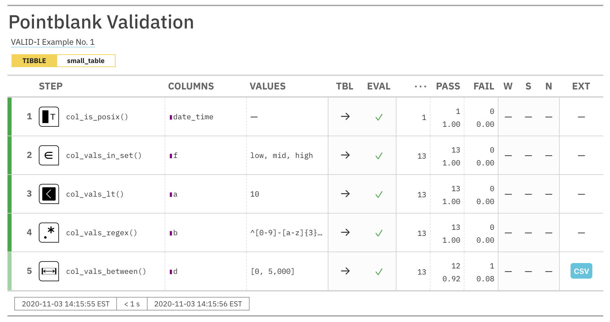
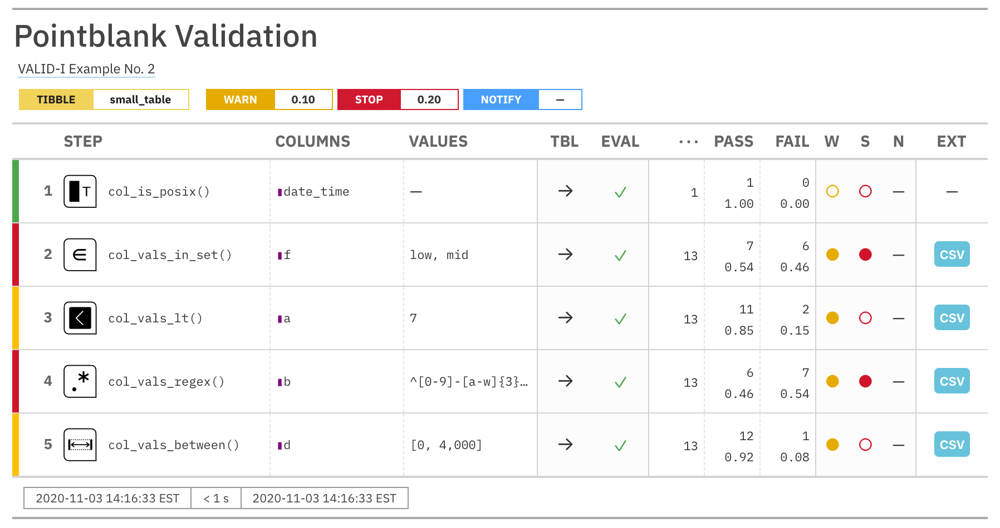

```{r setup, message=FALSE, warning=FALSE, include=FALSE}
library(pointblank)
library(glue)
```


When trying to assess the state of data quality for tabular data, we want to perform a full accounting of assertions on the data without stopping anywhere in the interrogation of the data. We use an object called an *agent* to collect our validation instructions, perform the interrogation, and then serve as an artifact for reporting or further analysis. We give that agent the name or a function that retrieves the target table. The types of data tables that can be used include data frames, tibbles, database tables (`tbl_dbi`), and Spark DataFrames (`tbl_spark`).

## The Elements of this Workflow: an *agent*, validation functions, and `interrogate()`

The *agent* that we need for this workflow is created with the `create_agent()` function. An agent can handle one target table at any given time and the `tbl` argument is where the target is specified. We can supply the input table directly to the *agent* by giving `tbl` the table object. Alternatively, we can make it such that the table is only read in at interrogation-time. This is useful in situations where we might deploy an agent from a YAML file. This 'lazy reading' of a target table can be accomplished in two ways: (1) using a 'table-prep formula', which is a one-sided **R** formula expression (e.g., `~ <table reading code>`), or (2) providing a function (e.g., `function() { <table reading code> }`).

The *agent* needs directives on what to do with the table, so, we provide validation functions. Some check for the existence or type of column (`col_exists()` or the group of `col_is_*()` functions). Others check each cell in a column for satisfying a specific condition (the `col_vals_*()` functions). We can use as many of these as necessary for satisfactory validation testing of the table in question. There are certainly quite a few of them, so here's a list of the validation functions with a questioning phrase for each function's purpose:

- `col_vals_lt()`: Are column data less than a specified value?
- `col_vals_lte()`: Are column data less than or equal to a specified value?
- `col_vals_equal()`: Are column data equal to a specified value?
- `col_vals_not_equal()`: Are column data not equal to a specified value?
- `col_vals_gte()`: Are column data greater than or equal to a specified value?
- `col_vals_gt()`: Are column data greater than a specified value?
- `col_vals_between()`: Are column data between two specified values?
- `col_vals_not_between()`: Are column data not between two specified values?
- `col_vals_in_set()`: Are column data part of a specified set of values?
- `col_vals_not_in_set()`: Are data not part of a specified set of values?
- `col_vals_make_set()`: Is a set of values entirely accounted for in a column of values?
- `col_vals_make_subset()`: Is a set of values a subset of a column of values?
- `col_vals_increasing()`: Are column data increasing by row?
- `col_vals_decreasing()`: Are column data decreasing by row?
- `col_vals_null()`: Are column data `NULL`/`NA`?
- `col_vals_not_null()`: Are column data not `NULL`/`NA`?
- `col_vals_regex()`: Do strings in column data match a regex pattern?
- `col_vals_within_spec()`: Do values in column data fit within a specification?
- `col_vals_expr()`: Do column data agree with a predicate expression?
- `rows_distinct()`: Are row data distinct?
- `rows_complete()`: Are row data complete?
- `col_is_character()`: Do the columns contain character/string data?
- `col_is_numeric()`: Do the columns contain numeric values?
- `col_is_integer()`: Do the columns contain integer values?
- `col_is_logical()`: Do the columns contain logical values?
- `col_is_date()`: Do the columns contain R `Date` objects?
- `col_is_posix()`: Do the columns contain `POSIXct` dates?
- `col_is_factor()`: Do the columns contain R `factor` objects?
- `col_exists()`: Do one or more columns actually exist?
- `col_schema_match()`: Do columns in the table (and their types) match a predefined schema?
- `row_count_match()`: Does the row count match that of a different table?
- `col_count_match()`:  Does the column count match that of a different table?
- `tbl_match()`: Does the target table match a comparison table?
- `conjointly()`: Do multiple rowwise validations result in joint validity?
- `serially()`: Run several tests and a final validation in a serial manner
- `specially()`: Perform a specialized validation with a user-defined function

The final function that needs to be called is the `interrogate()` function. The validation functions, when called on an *agent* object, don't act on the target table until `interrogate()` is used. In fact, until interrogation, the usage of validation functions serves as instructions (building up an interrogation plan). During the interrogation phase (i.e., when calling `interrogate()`) those instructions turn into actions, with the *agent* then carrying out all the validation steps of the interrogation plan.

## A Simple Example with the Basics

For our examples going forward, we'll use the `small_table` dataset. It's included in the **pointblank** package. It isn't very large, which makes it great for simple examples. Here it is in its entirety:

```{r small_table, paged.print=FALSE}
small_table
```

What follows is a very simple validation plan. We will test that:

1. the `date_time` column is indeed a date-time column
2. column `f` only has the values `"low"`, `"mid"`, and `"high"`
3. the values in column `a` are all less than `10`
4. The strings in column `b` fit a particular regex pattern (`"^[0-9]-[a-z]{3}-[0-9]{3}$"`)
5. column `d` has values in the range of `0` to `5000` (this is not entirely true!)

This is how the validation plan is written and interrogated. When carried out interactively, you'll get status messages that describe how the interrogation is going.

```{r agent_small_table_1}
agent <- 
  create_agent(
    tbl = small_table,
    tbl_name = "small_table",
    label = "VALID-I Example No. 1"
  ) %>%
  col_is_posix(vars(date_time)) %>%
  col_vals_in_set(vars(f), set = c("low", "mid", "high")) %>%
  col_vals_lt(vars(a), value = 10) %>%
  col_vals_regex(vars(b), regex = "^[0-9]-[a-z]{3}-[0-9]{3}$") %>%
  col_vals_between(vars(d), left = 0, right = 5000) %>%
  interrogate()
```

```
── Interrogation Started - there are 5 steps ──────────────────────────────────
✓ Step 1: OK.
✓ Step 2: OK.
✓ Step 3: OK.
✓ Step 4: OK.
✓ Step 5: OK.

── Interrogation Completed ─────────────────────────────────────────────────
```

The five `OK` messages means that all of the individual validations in each of those five validation steps passed within the failure threshold levels. Since failure thresholds actually weren't set, these steps will always display `OK` unless an evaluation error occurred (e.g., attempting to interrogate a column that isn't present in the target table). Printing the `agent` object gives a step-by-step breakdown of the interrogation process.

```{r get_agent_report_1, eval=FALSE}
agent
```



Let's have a look at how to interpret this report. The bright green color strips at the left of each validation step indicates that all test units passed validation. The lighter green color in the final step means that there was at least one failing unit.

The `STEP` column provides the name of the validation function used as a basis for a validation step. `COLUMNS` shows us the target column for each validation step. The `VALUES` column lists any values required for a validation step. What is `TBL`? That indicates whether the table was mutated just before interrogation in that validation step (via the `preconditions` argument, available in every validation function). The right-facing arrows indicate that the table didn't undergo any transformation, so we are working with the identity table in every step. `EVAL` lets us know whether there would be issues in evaluating the table itself (catching **R** errors and warnings); the checkmarks down this column show us that there were no issues during interrogation.

The total number of test units is provided next in the `...` column, then the absolute number and fraction of passing test units (`PASS`) and failing test units (`FAIL`). The `W`, `S`, `N` indicators tell us whether we have entered either of the `WARN`, `STOP`, or `NOTIFY` states for each these validation steps. Because we didn't set any threshold levels for these states (that can be done with the `actions` argument, more on that later), they are irrelevant for this report. Finally, the `EXT` column provides an opportunity to download any data extract rows as a CSV. These rows represent the rows with failed test units. For *step 5*, the `col_vals_between()` validation step, there is a data extract available (with `1` row). We can either download the CSV from the report or examine that extract in **R** with the `get_data_extracts()` function:

```{r get_data_extracts, paged.print=FALSE}
get_data_extracts(agent, i = 5)
```

Recall that validation *step 5* asserted that all values in column `d` should be between `0` and `5000`, however, this extract of `small_table` shows that column `d` has a value of `10000` which lies outside the specified range.

## Using Threshold Levels and Actions

It can be useful to gauge data quality by setting failure thresholds for validation steps. For example, it may be acceptable at some point in time to tolerate up to 5% of failing test units for a given validation. Or, having several levels of data quality might be useful and instructive, where failing test units across validations are grouped into the 0-5%, 5-10%, and 10%- bands.

We can specify failure threshold levels with the `action_levels()` function. Using the function generates an `action_levels` object that can be passed to the `actions` argument of `create_agent()` (thereby creating a default for every validation step). In the following, we use relative values (as real numbers between `0` and `1`) to define thresholds for the `WARN` and `STOP` conditions. 

```{r action_levels_set_1}
al <- action_levels(warn_at = 0.1, stop_at = 0.2)
```

Printing the `al` object gives us a summary of the settings.

```{r action_levels_print_1}
al
```

Let's use the `action_levels` object in a new validation. It's similar to the last one but the parameters for some of the validation functions will result in more failing test units. We'll see that the interrogation messages show mention of `STOP` and `WARNING` conditions being met.

```{r agent_small_table_2, eval=FALSE}
agent <- 
  create_agent(
    tbl = small_table,
    tbl_name = "small_table",
    label = "VALID-I Example No. 2",
    actions = al
  ) %>%
  col_is_posix(vars(date_time)) %>%
  col_vals_in_set(vars(f), set = c("low", "mid")) %>%
  col_vals_lt(vars(a), value = 7) %>%
  col_vals_regex(vars(b), regex = "^[0-9]-[a-w]{3}-[2-9]{3}$") %>%
  col_vals_between(vars(d), left = 0, right = 4000) %>%
  interrogate()
```

```
── Interrogation Started - there are 5 steps ──────────────────────────────────
✓ Step 1: OK.
x Step 2: STOP condition met.
! Step 3: WARNING condition met.
x Step 4: STOP condition met.
! Step 5: WARNING condition met.

── Interrogation Completed ─────────────────────────────────────────────────
```

Printing the agent will provide a very different agent report than seen previously, one that's rife with yellow and red color strips to the left and matching colors in the far right columns.

```{r get_agent_report_2, eval=FALSE}
agent
```



It's possible to invoke a function when a particular failure condition is met and this can be set in the `action_levels()` function and made part of the `action_levels` object. One example of a function that can be used is the included `log4r_step()` function for logging failure conditions across validation steps. Let's make a new `action_levels` object and include the logging function in the `WARN` and `STOP` failure conditions. Note that the function calls must be written as one-sided **R** formulas.

```{r action_levels_set_2}
al <- 
  action_levels(
    warn_at = 0.1,
    stop_at = 0.2,
    fns = list(
      warn = ~ log4r_step(x),
      stop = ~ log4r_step(x)
    )
  )
```

Printing this new `al` object will show us the failure threshold settings and the associated actions for the failure conditions.

```{r action_levels_print_2}
al
```

Using this new `al` object with our validation workflow will result in failures at certain validation steps to be logged. By default, this is to a file named `"pb_log_file"` in the working directory but the `log4r_step()` function is flexible for allowing any **log4r** *appender* to be used. Running the following data validation code

```{r agent_small_table_3, eval=FALSE}
agent <- 
  create_agent(
    tbl = small_table,
    tbl_name = "small_table",
    label = "VALID-I Example No. 3",
    actions = al
  ) %>%
  col_is_posix(vars(date_time)) %>%
  col_vals_in_set(vars(f), set = c("low", "mid")) %>%
  col_vals_lt(vars(a), value = 7) %>%
  col_vals_regex(vars(b), regex = "^[0-9]-[a-w]{3}-[2-9]{3}$") %>%
  col_vals_between(vars(d), left = 0, right = 4000) %>%
  interrogate()
```

will show us the same messages as before in the **R** console

```
── Interrogation Started - there are 5 steps ──────────────────────────────────
✓ Step 1: OK.
x Step 2: STOP condition met.
! Step 3: WARNING condition met.
x Step 4: STOP condition met.
! Step 5: WARNING condition met.

── Interrogation Completed ─────────────────────────────────────────────────
```

and the file `"pb_log_file"` can be looked at with `readLines()`, showing us four entries (one for each validation step with at least a `WARN` condition).

```{r read_log_file, eval=FALSE}
readLines("pb_log_file")
```

```
[1] "ERROR [2020-11-06 01:26:07] Step 2 exceeded the STOP failure threshold (f_failed = 0.46154) ['col_vals_in_set']" 
[2] "WARN  [2020-11-06 01:26:07] Step 3 exceeded the WARN failure threshold (f_failed = 0.15385) ['col_vals_lt']"     
[3] "ERROR [2020-11-06 01:26:07] Step 4 exceeded the STOP failure threshold (f_failed = 0.53846) ['col_vals_regex']"  
[4] "WARN  [2020-11-06 01:26:07] Step 5 exceeded the WARN failure threshold (f_failed = 0.07692) ['col_vals_between']"
```

The `log4r_step()` function is a bit special in that it only provides the most severe condition in a given validation step, so long as the function call is present in multiple conditions of the `list()` given to `action_levels()`'s `fns` argument.

It's possible to provide any custom-made function that generates some side effect in the same way as `log4r_step()` is used. Just like `log4r_step()`, the custom function can take advantage of the `x` variable, which is the x-list for the validation step. Let's take a look at what that is for step 2 (the `col_vals_in_set` validation step) by using the `get_agent_x_list()` function:

```{r get_agent_x_list, eval=FALSE}
x <- get_agent_x_list(agent, i = 2)
x
```
```
── The x-list for STEP 2 ────────────────────────────────────────────
$time_start $time_end (POSIXct [1])
$label $tbl_name $tbl_src $tbl_src_details (chr [1])
$tbl (spec_tbl_df, tbl_df, tbl, and data.frame)
$col_names $col_types (chr [8])
$i $type $columns $values $label $briefs (mixed [1])
$eval_error $eval_warning (lgl [1])
$capture_stack (list [1])
$n $n_passed $n_failed $f_passed $f_failed (num [1])
$warn $stop $notify (lgl [1])
$lang (chr [1])
─────────────────────────────────────────────────────────────────
```

The message in the console shows us what's available in `x`, with some indication of the output types. If we wanted to know the number of test units, the fraction of those that failed, and whether the `STOP` condition was entered, we can access those and even put them into a character string (along with other info from the x-list).

```{r glue_with_x, eval=FALSE}
glue::glue(
  "In Step {x$i}, there were {x$n} test units and {x$f_failed * 100}% \\
  failed. STOP condition met: {tolower(x$stop)}."
  )
```

```
In Step 2, there were 13 test units and 46.154% failed. STOP condition met: true.
```

This is a great way to test a function for use as a validation step 'action' because when invoked it will undergo evaluation in an environment that contains `x` (which will have the same structure).
