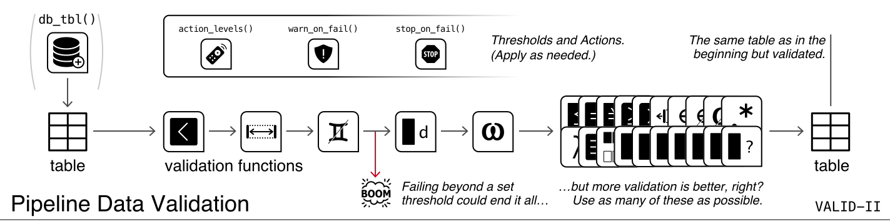

```{r setup, message=FALSE, warning=FALSE, include=FALSE}
library(pointblank)
```



The second data validation workflow, *VALID-II: Pipeline Data Validation*, somewhat simplifies the process for checking data directly. There is no *agent* involved here and we instead call validation functions directly on the data table objects. Because no *agent*, there is no report, and the idea is that the side effects are most important here. We can trigger warnings, raise errors, or write out logs when exceeding specified failure thresholds. The data just passes through the validation functions (some data in, the same data out).

Where would we do this? When importing data, for instance, we could pass the incoming data through a few validation functions, possibly with customized threshold levels set (by default, any test units failing will result in an error). We could also use a set of validation functions further down the script on transformed data as a QA/QC measure. If bad data quality might be ruinous for a downstream report (especially in an automated context), it's better to stop the process through **pointblank** validation tests and get to the heart of the matter. And, just like every workflow in **pointblank**, the target table can be a data frame or tibble, a database table (a `tbl_dbi` object), or a Spark DataFrame (a `tbl_spark` object, by way of the **sparklyr** package).

# An Example of This Workflow

Let's adapt an example used in the [*VALID-I: Data Quality Reporting Workflow*](../articles/VALID-I.html) article to the pipeline data validation workflow:

```{r error=TRUE, paged.print=FALSE}
small_table %>%
  col_is_posix(vars(date_time)) %>%
  col_vals_in_set(vars(f), set = c("low", "mid", "high")) %>%
  col_vals_lt(vars(a), value = 10) %>%
  col_vals_regex(vars(b), regex = "^[0-9]-[a-z]{3}-[0-9]{3}$") %>%
  col_vals_between(vars(d), left = 0, right = 5000)
```

In terms of the expressions used in the pipeline, you might notice that the `create_agent()` and `interrogate()` functions are absent. This is due to the secondary role of the validation functions, where they can operate directly and immediately on the data, acting as a sort of filter. If all validations in this pipeline pass (i.e., there are no failing test units in any of the validation steps), then the `small_table` data is returned. Otherwise, as it's currently written, a stoppage will occur on any such failure.

As it turns out, the above validation pipeline did result in an error. The stringent default threshold setting stops the evaluation of the pipeline at the point of failure (one or more test units failing). This, in turn, stops the running script (a key consideration if the script is deployed and automatically running on some sort of schedule). In this type of workflow we don't need to define those functions, **pointblank** will automatically do the sensible thing by stopping evaluation and providing a stock message. So, in the first instance of such a stoppage due to validation failing, **R** scripts will stop at that point and **R Markdown** documents will correspondingly cease to render. 

# Modifying the Behavior of Validation Failures

There are ways to counteract the stopping behavior seen in the previous example. In an **R Markdown** document, we could set the chunk option `error = TRUE` where we might expect an error to occur due to validation failure (allowing execution to continue no matter what happens). That's what was done for the `small_table` example in this very document, giving us the error message printed below the input. Another way is to disable evaluation at the step level is to use the `active = FALSE` option on every validation function that shouldn't be evaluated. This works for both **R** scripts and **R Markdown** documents but it is quite different since we can't determine whether a validation passed or failed since it doesn't actually perform the check (it simply skips it). It is useful, however, if you want to enable staged checks use data validations in a sort of 'debug mode' since global variables that are logical can be passed to the `active` argument in specific validation functions. Another strategy is to not `stop()` but instead `warn()`.

## Using `warn_on_fail()` and `stop_on_fail()` functions to generate simple `action_levels`

There are two helper functions that are convenient for this workflow: `warn_on_fail()` and `stop_on_fail()`. These functions return an `action_levels` object that either warns or stops, doing so with informative warning or error messages. The default failure threshold for each is set to `1`: one *fail* unit means that the threshold for the `WARN` or `FAIL` condition will be met. The `stop_on_fail()` helper is (behind the scenes) applied by default when using validation functions in the *VALID-II* workflow. So, the previous example is exactly the same as this expanded form:

```{r error=TRUE, paged.print=FALSE}
small_table %>%
  col_is_posix(
    vars(date_time),
    actions = stop_on_fail(stop_at = 1)
  ) %>%
  col_vals_in_set(
    vars(f), set = c("low", "mid", "high"),
    actions = stop_on_fail(stop_at = 1)
  ) %>%
  col_vals_lt(
    vars(a), value = 10,
    actions = stop_on_fail(stop_at = 1)
  ) %>%
  col_vals_regex(
    vars(b), regex = "^[0-9]-[a-z]{3}-[0-9]{3}$",
    actions = stop_on_fail(stop_at = 1)
  ) %>%
  col_vals_between(
    vars(d), left = 0, right = 5000,
    actions = stop_on_fail(stop_at = 1)
  )
```

If we want to instead issue warnings, perhaps with less stringent failure thresholds in certain steps, the `warn_on_fail()` function provides a simple way to express this.

```{r warn=TRUE, paged.print=FALSE}
small_table %>%
  col_is_posix(
    vars(date_time),
    actions = warn_on_fail()
  ) %>%
  col_vals_in_set(
    vars(f), set = c("low", "mid", "high"),
    actions = warn_on_fail(warn_at = 0.2)
  ) %>%
  col_vals_lt(
    vars(a), value = 10,
    actions = warn_on_fail(warn_at = 3)
  ) %>%
  col_vals_regex(
    vars(b), regex = "^[0-9]-[a-z]{3}-[0-9]{3}$",
    actions = warn_on_fail(warn_at = 0.2)
  ) %>%
  col_vals_between(
    vars(d), left = 0, right = 5000,
    actions = warn_on_fail(warn_at = 1)
  )
```

While `warn_on_fail()` and `stop_on_fail()` are handy ways to generate `action_levels` objects for the `actions` argument in every validation function, it doesn't provide a way to specify any actions. For that, we'll need to use the `action_levels()` function directly.

## Using `action_levels()` for More Control

The `action_levels()` function can be as useful here as it is for the [**VALID-I**](../articles/VALID-I.html) workflow with an *agent*. The function creates an `action_levels` object which can have two roles: (1) specification of threshold failure levels for entering certain conditions (`WARN`, `STOP`, and `NOTIFY`), and (2) setting of actions (i.e., function calls to invoke) when entering a specific condition. The `fns` argument of `action_levels()` allows us to define those custom functions that are evaluated upon entering each of the three states (and this acts on the 'step' level, per each validation function).

Compared to the [**VALID-I**](../articles/VALID-I.html) workflow, which deals more with reporting, having actions triggered by failures in the **VALID-II** workflow is probably more useful and important. We can imagine a situation where an **R** script is deployed with data validation interspersed throughout. Depending on the deployment, we may desire a hard stop (affecting the downstream components), or, we may want a softer approach with warning and logging.

Let's try a hybrid approach where each of three available conditions have failure threshold levels set and an associated function to invoke. The functions to invoke at each condition can be whatever makes sense for the workflow (i.e., we don't have to issue warnings in the `WARN` condition if we want something else). Here, we will use a `warning()` for `WARN`, a `stop()` for `STOP`, and a logging function (`log4r_step()`) for `NOTIFY`. Here's how we might create such an `action_levels` object with `action_levels()`:

```{r action_levels_set_1}
al <- 
  action_levels(
    warn_at = 0.1,
    stop_at = 0.2,
    notify_at = 0.3,
    fns = list(
      warn = ~ warning("WARN threshold exceeded."),
      stop = ~ stop("STOP threshold exceeded."),
      notify = ~ log4r_step(x)
    )
  )
```

Once we assigned the `action_levels` to an object (in this case, as `al`) we can print it to get a summary of the settings.

```{r eval=FALSE}
al
```

```
── The `action_levels` settings ────────────────────────────────────────────
WARN failure threshold of 0.1 of all test units.
\fns\ ~ warning("WARN threshold exceeded.")
STOP failure threshold of 0.2 of all test units.
\fns\ ~ stop("STOP threshold exceeded.")
NOTIFY failure threshold of 0.3 of all test units.
\fns\ ~ log4r_step(x)
──────────────────────────────────────────────────────────────────────────
```

Finally, we will apply this object to every validation function call in the expression (changed slightly to result in more test units failing).

```{r error=TRUE, paged.print=FALSE}
small_table %>%
  col_is_posix(vars(date_time), actions = al) %>%
  col_vals_in_set(vars(f), set = c("low", "mid"), actions = al) %>%
  col_vals_lt(vars(a), value = 7, actions = al) %>%
  col_vals_regex(vars(b), regex = "^[0-9]-[a-w]{3}-[2-9]{3}$", actions = al) %>%
  col_vals_between(vars(d), left = 0, right = 4000, actions = al)
```

In addition to an error and a warning, the `log4r_step()` function used for the `NOTIFY` condition generates, in this case, a new `"pb_log_file"` text file for logs. We can examine it with `readLines()`; it has a single entry that relates to `Step 1` (the `col_vals_in_set()` step):

```{r read_log_file, eval=FALSE}
readLines("pb_log_file")
```

```
FATAL [2020-11-09 00:23:48] Step 1 exceeded the NOTIFY failure threshold (f_failed = 0.46154) ['col_vals_in_set']
```

The `log4r_step()` function offered by **pointblank** is shown in examples and explained in more detail in the [*VALID-I: Data Quality Reporting Workflow*](../articles/VALID-I.html) article.
