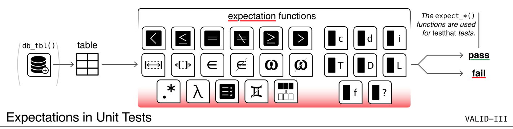

```{r options, message=FALSE, warning=FALSE, include=FALSE}
knitr::opts_chunk$set(
  collapse = TRUE,
  comment = "#>"
)

library(pointblank)
```



### Introduction to the **Expectations in Unit Tests** Workflow (**VALID-III**)

The *VALID-III: Expectations in Unit Tests* workflow is all about checking your data alongside your usual **testthat** tests.

