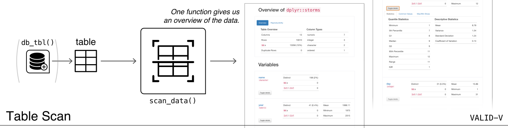

```{r options, message=FALSE, warning=FALSE, include=FALSE}
knitr::opts_chunk$set(
  collapse = TRUE,
  comment = "#>"
)

library(pointblank)
library(palmerpenguins)
```



### Introduction to the **Table Scan** Workflow (**VALID-V**)

The *VALID-V: Table Scan* workflow consists of a single function: `scan_data()`. So simple, and it gives you so much information on a data table. The function generates an HTML report that scours the input table data. This is great to use before diving into the other workflows because it's a good idea to first understand the target table with some level of precision. 

The reporting output contains several sections to make everything more digestible, and these are:

 - Overview: Shows table dimensions, duplicate row counts, column types, and reproducibility information
 - Variables: Provides a summary for each table variable and further statistics and summaries depending on the variable type
 - Interactions: Displays a matrix plot that describes the interactions between variables
 - Correlations: This is a set of correlation matrix plots for numerical variables
 - Missing Values: A summary figure that shows the degree of missingness across variables
 - Sample: A table that provides the head and tail rows of the dataset

#### An Example with the Palmer Penguins

The output HTML report will appear in the RStudio Viewer and can also be integrated in R Markdown HTML output. Here's an example that uses the `penguins_raw` dataset from the **palmerpenguins** package. In the `scan_data()` call, the option to deactivate the display of the navigation bar has been taken with `navbar = FALSE`, which makes some sense when integrating this type of output in a larger document.

```{r}
scan_data(palmerpenguins::penguins_raw, navbar = FALSE)
```

As could be seen, the first two sections had a lot of additional information tucked behind detail views (with the `Toggle details` buttons) and in tabsets. Should this amount of information be a little overwhelming, there is the option to disable one or more sections. With `scan_data()`'s `sections` argument, you can specify just the sections that are needed for a specific scan.


If you need the output HTML as a string, it's possible to get that by using `as.character()` (e.g., `scan_data(tbl = mtcars) %>% as.character()`). The resulting HTML string is a complete HTML document.


