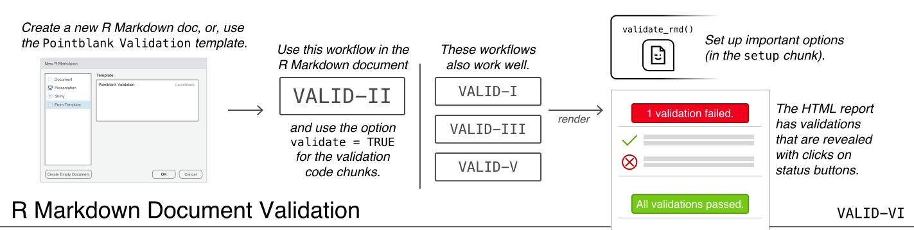
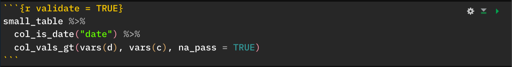
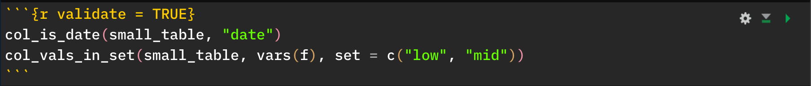
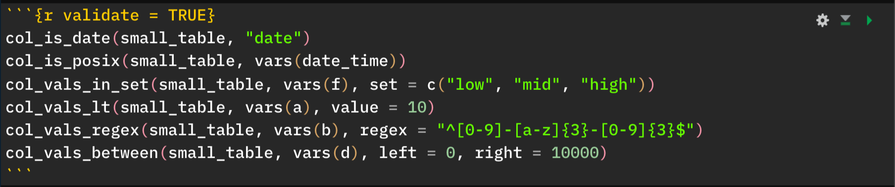

```{r setup, message=FALSE, warning=FALSE, include=FALSE}
library(pointblank)
validate_rmd(summary = FALSE)
```



The *R Markdown Document Validation* workflow involves interspersing bits of different workflows in the larger R Markdown workflow. It's great to use when doing data analysis work in the familiar *R Markdown* environment, striking a balance between checking your work and getting a bit out of the way when the document is rendered to HTML. 

## How It Works

Using **pointblank** in the **VALID-VI** workflow is enabled by default once the **pointblank** library is loaded (best done in the `setup` chunk). The framework allows for validation testing within specialized validation code chunks where the `validate = TRUE` option is set. Using **pointblank** validation functions on data (the [**VALID-II**](../articles/VALID-II.html) workflow) in these marked code chunks will flag overall failure if the stop threshold is exceeded anywhere.

All errors are shown after rendering the document to HTML. Green status buttons indicate that all validations succeeded, red buttons indicate that one or more validation failures occurred. Clicking any such button reveals the otherwise hidden validation statements and associated messaging.

It's much better to demonstrate how this workflow works in a series of examples, as the resulting output is interactive and varies quite a bit depending on the input. In all of the following examples, a code chunk will shown and the rendered result will be subsequently placed. The result will typically be a button that can be pressed to reveal the validation result and the code chunk itself is hidden upon rendering (so there's no need to use `include = FALSE` as a chunk option).

To start things off, here's an example that uses an expression that takes the `small_table` dataset and pipes it to two validation functions: `col_is_date()` and `col_vals_in_set()`. The `col_is_date()` validation passes whereas the `col_vals_in_set()` validation fails (because the set of values in column `f` also has the `"high"` value.



```{r validate = TRUE}
small_table %>% 
  col_is_date("date") %>% 
  col_vals_in_set(vars(f), set = c("low", "mid"))
```

Clicking the above `1 validation failed.` button will reveal that the *expression* failed validation because of a validation function failing within it. If you break it down, really one validation step in the chain passed (the first one) and one failed (the second). If there were additional validation steps that would otherwise pass, we'd still get the same result and output because the failing step ends execution.

Because this workflow is meant to stop an expression from executing at the first validation function that fails, it's advisable to break down these validations to single steps. That way, each expression is a single validation that either passes or fails and is reported accordingly. Let's rewrite the above example as two expressions, one per validation.



```{r validate = TRUE}
col_is_date(small_table, "date")
col_vals_in_set(small_table, vars(f), set = c("low", "mid"))
```

It still says that `1 validation failed.` (this workflow focuses on the negatives) but pressing the button reveals that the first one passed and the second failed. This is much clearer and we don't run the risk of not evaluating validations because a validation failed earlier in a pipeline.

Here's an example where all validations in individual expressions pass, showing us a green status button.



```{r validate = TRUE}
col_is_date(small_table, "date")
col_is_posix(small_table, vars(date_time))
col_vals_in_set(small_table, vars(f), set = c("low", "mid", "high"))
col_vals_lt(small_table, vars(a), value = 10)
col_vals_regex(small_table, vars(b), regex = "^[0-9]-[a-z]{3}-[0-9]{3}$")
col_vals_between(small_table, vars(d), left = 0, right = 10000)
```

It's worth reminding at this point that failed validations do not stop execution of the R Markdown rendering. Otherwise you wouldn't see a document with any failing validations, and, you wouldn't know where those failed validations occurred. The expectation for this workflow is to add in the relevant validation expressions at key junctures and should any failures occur, one can fix the underlying issues until all (or enough) validations pass.

## The **pointblank** `stop_if_not()` Function

You may not want to use the set of validation functions for everything. Perhaps using `stopifnot()` is sufficient for some validations. In that case, consider using **pointblank** variation on that: `stop_if_not()`. It works well enough as a standalone, replacement for `stopifnot()` but the advantage here is that `stop_if_not()` is customized for use in the **VALID-VI** workflow (or in any situation where you're using R Markdown to render to HTML, and **pointblank** is loaded via `library()`). Ultimately, using `stop_if_not()` in a code chunk where the `validate = TRUE` option is set will yield the correct reporting of successes and failures whereas `stopifnot()` does not.

Here's a code chunk that uses `stop_if_not()` twice to check two different assertions on the `small_table` object. The first one passes whereas the second one fails.


```{r validate = TRUE}
stop_if_not(nrow(small_table) < 20)
stop_if_not("time" %in% colnames(small_table))
```

Keep in mind that `stop_if_not()` (like `stopifnot()`) can be used for any type of assertion. It's not limited to checking tables like the functions in **pointblank** are focused on.

#### Including Data Quality Reporting from the **VALID-I** Workflow

Code chunks can include data quality reporting expressions (i.e., the *agent*-based [**VALID-I**](../articles/VALID-I.html) workflow) but it's important to ensure two things. Here's the interesting thing about that: we can opt to use `validate = TRUE` as a chunk option or omit that entirely, each choice has different effect. If you'd like to hide the validation output (the *Agent Report*) behind a button (in this case, a light blue one) then `validate = TRUE` should be used.

Here's an example of a data quality validation workflow being executed in a single code chunk.


```{r validate = TRUE}
# Define an `action_levels` object
al <- action_levels(warn_at = 0.1, stop_at = 0.2)

# Perform a validation with an `agent`
create_agent(
    tbl = small_table,
    tbl_name = "small_table",
    label = "VALID-I Example No. 2",
    actions = al
  ) %>%
  col_is_posix(vars(date_time)) %>%
  col_vals_in_set(vars(f), set = c("low", "mid")) %>%
  col_vals_lt(vars(a), value = 7) %>%
  col_vals_regex(vars(b), regex = "^[0-9]-[a-w]{3}-[2-9]{3}$") %>%
  col_vals_between(vars(d), left = 0, right = 4000) %>%
  interrogate()
```

If this code chunk were to exclude the `validate = TRUE` option, then the output would appear as output normally does (where the input appears above output report table). Should you just want the output reporting table to shown without the input expressions, you could use the `include = FALSE` chunk option here.

As a final note for this, it's important not to use any other expressions that result in output, just stick to the typical `create_agent()` &rarr; `<validation functions>` &rarr; `interrogate()` pattern. In other words, dedicate this code chunk just to the *agent* and put other validation expressions elsewhere in the document.

## Setting Up Options with the `validate_rmd()` Function

We can modify the **pointblank** validation testing options within R Markdown documents with the `validate_rmd()` function. While the framework for such testing is set up by default, using `validate_rmd()` offers an opportunity to set up UI and logging options.

With the `summary` argument, if `TRUE` (the default), then there will be a leading summary of all validations in the rendered R Markdown document. With `FALSE`, this element is not shown. For this document, `validate_rmd(summary = FALSE)` was placed in the `setup` chunk (right after the `library(pointblank)` statement) and this resulted in suppressing the display of the overall summary of validation results.

With the `log_to_file` argument, there's the option to log errors to a text file. By default, no logging is done but setting `log_to_file == TRUE` will write log entries to the `"validation_errors.log"` file in the working directory (will be generated if non-existent, appended to if available). To both enable logging and specify the name of the file, include a path to a log file (with the desired name) to `log_to_file`.
