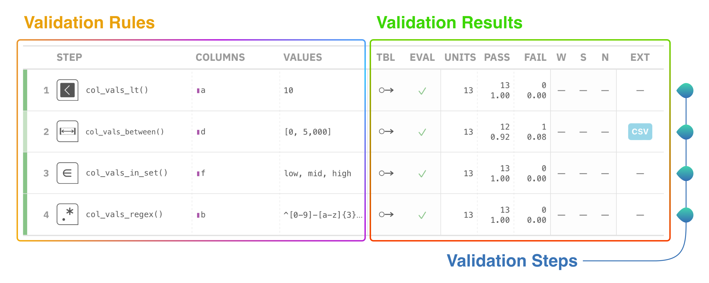

```{r, include = FALSE}
knitr::opts_chunk$set(
  collapse = TRUE,
  comment = "#>"
)
```

```{r setup}
library(pointblank)
```

The pointblank package is all about assessing the state of data quality for a table. 
You provide the validation rules and the package will dutifully interrogate the data and provide useful reporting.
We can use data frames, tibbles, database tables (`tbl_dbi`), and Spark DataFrames (`tbl_spark`).
Let's walk through what data validation looks like in pointblank.

## The Basic Building Block: Validation Rules

We use a `small_table` for our example. 
We expect the values in column `a` to be less than 10. 
We can specify this validation rule via `col_vals_lt()`.

```{r}
data(small_table)

small_table %>%
  col_vals_lt(a, value = 10)
```

If the table fulfills the validation rule, it just return the input table - so we can directly pass that to further validation rules.

```{r error=TRUE, paged.print=FALSE}
small_table %>%
  col_vals_lt(a, value = 10) %>%
  col_vals_between(d, left = 0, right = 5000) %>% 
  col_vals_in_set(f, set = c("low", "mid", "high")) %>%
  col_vals_regex(b, regex = "^[0-9]-[a-z]{3}-[0-9]{3}$")
```

One of them fails! 
Now we know that the data quality of the table wasn't what we were expecting. 
If you are assessing the data quality to make sure no poor data is fed into a data processing pipeline or a model, this error may be all you need to stop the process.

## A Simple Validation Table

If you are building a report on the state of your data quality you can capture more fine-graned information in a validation table.

This is the validation report table produced from the above validation of `small_table`:

```{r echo = FALSE}
small_table %>%
  create_agent() %>% 
  col_vals_lt(a, value = 10) %>%
  col_vals_between(d, left = 0, right = 5000) %>% 
  col_vals_in_set(f, set = c("low", "mid", "high")) %>%
  col_vals_regex(b, regex = "^[0-9]-[a-z]{3}-[0-9]{3}$") %>% 
  interrogate()
```

Each row in this reporting table constitutes a single validation step. 
Roughly, the left-hand side outlines the validation rules and the right-hand side provides the results of each validation step.
While simple in principle, there's a lot of useful information packed into this validation table.

Here's a diagram that describes a few of the important parts of the validation table:




There are three things that should be noted here:

- Validation steps: each step is a separate test on the table, focused on a certain aspect of the
table.
- Validation rules: the validation type is provided here along with key constraints.
- Validation results: interrogation results are provided here, with a breakdown of test units
(*total*, *passing*, and *failing*), threshold flags, and more.

The intent is to provide the key information in one place, and have it be interpretable by data
stakeholders.

## Example Code, Step-by-Step

Here's the code that performs the validation on the data frame.

```{r, eval = FALSE}
agent <- small_table %>%
  create_agent() %>% 
  col_vals_lt(a, value = 10) %>%
  col_vals_between(d, left = 0, right = 5000) %>% 
  col_vals_in_set(f, set = c("low", "mid", "high")) %>%
  col_vals_regex(b, regex = "^[0-9]-[a-z]{3}-[0-9]{3}$") 
  
agent %>% 
  interrogate()
```

Note these three key pieces in the code:

- The `create_agent()` function takes a data frame or database table that you want to validate.
- The functions starting with `col_*` specify validation steps that run on specific columns.
- The `interrogate()` function executes the validation plan on the target table and returns the validation table.

This common pattern is used in a validation workflow, where `create_agent()` and `interrogate()` bookend a validation plan generated through calling validation methods. 
And that's data validation with pointblank in a nutshell! 
In the next section we'll go a bit further by understanding how we can measure data quality with test units and failure thresholds.


## Understanding Test Units

Each validation step will execute a type of validation test on the target table.
For example, a `col_vals_lt()` validation step can test that each value in a column is less than a specified number. 
The key finding that's reported as a result of this test is the number of test units that pass or fail.

Test units are dependent on the test being run. 
The collection of `col_vals_*` validation methods will test each and every value in a particular column, so each value will be a test unit (and the number of test units is the number of rows in the target table).
Some validation methods like `col_exists()` or `row_count_match()` have only a single test unit since they aren't testing individual values but rather if a single condition is true or false.

## Using Action Levels

Knowing about the numbers of test units across validation methods matters because you have the option to set action levels (that can signal 'warn', 'error', and 'critical' flags) based on either the relative proportion or absolute number of failing test units.

```{r}
al <- action_levels(warn = 2, error = 4)

small_table %>%
  col_vals_lt(a, value = 7, actions = al)
```

Here we set a threshold of `2` failed units for a warning and `4` for an error. 
You can set the action levels for individual validation rules via the `actions` argument.
If you set it while creating the agent, it applies to all rules in a validation plan.

```{r}
small_table %>%
  create_agent(actions = al) %>% 
  col_vals_lt(a, value = 7) %>%
  interrogate()
```

If you look at the validation report table, we can see:

- The `FAIL` column shows that 2 tests units have failed.
- the `W` column (short for 'warning') shows a filled yellow circle indicating those failing test
units reached that threshold value.
- the `E` column (short for 'error') shows an open red circle indicating that the number of
failing test units is below that threshold.

The one final action level, `C` (for 'critical'), wasn't set so it appears on the validation table as a long dash.

Setting thresholds is important since you might want some sort of signal for the discovery of errors in your data. 
How you set the particular threshold levels is highly dependent on your tolerance for data failures. 
